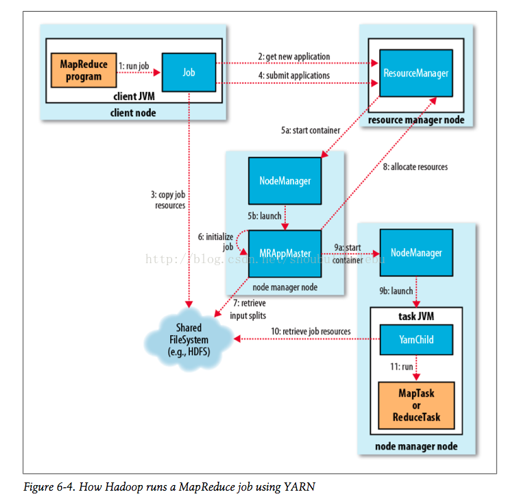

# 关于YARN
YARN是Hadoop的集群资源管理系统。  

| 应用 | MapReduce | Spark | Tez | ... |
| :---: | :---: |:---: | :---: | :---: |
| 系统 | YARN | YARN | YARN | YARN |
| 存储 | HDFSandHBase | HDFSandHBase | HDFSandHBase | HDFSandHBase |
## 剖析YARN应用运行机制

步骤1: 要求他运行一个application master进程  
步骤2: 资源管理器找到一个能够在容器中启动application master的节点管理器  
步骤3: 可能向资源管理器请求更多的容器  
步骤4: 用于运行一个分布式计算。之后就是MapReduceYARN应用所做的事情。  
大多数重要的YARN应用使用某种的远程通信机制（例如Hadoop的RPC层）来向客户端传递状态更新和返回结果，但是这些通信机制都是
专属于各应用层。  
## YARN与MapReduce1相比

|MapReduce|YARN|
|:--- |:--- |
|Jobtracker|资源管理器、application、时间轴服务器|
|Tasktracker|节点管理器|
|Slot|容器|
YARN的很多设计是为了解决MapReduce1的局限性
### 可扩展性
如：当节点数达到4000，任务数到达40000时，MapReduce1会遇到可扩展性瓶颈，瓶颈源自于jobtracker必须同时管理作业和任务这样一个事实。
YARN利用其资源管理器和application master分离的架构有点克服这个局限性，可以扩展到面向将近10000个节点和100000个任务
