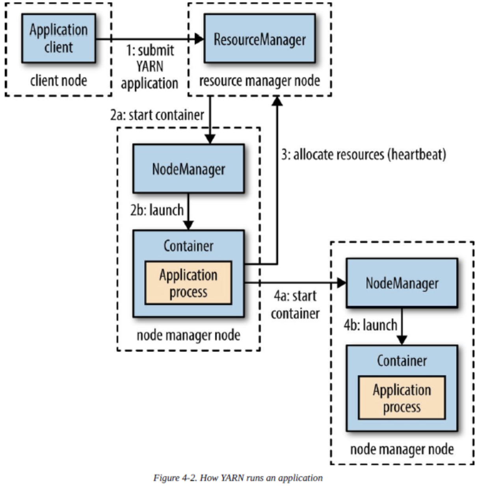

# 关于YARN
YARN是Hadoop的集群资源管理系统。  

| 应用 | MapReduce | Spark | Tez | ... |
| :---: | :---: |:---: | :---: | :---: |
| 系统 | YARN | YARN | YARN | YARN |
| 存储 | HDFSandHBase | HDFSandHBase | HDFSandHBase | HDFSandHBase |
## 剖析YARN应用运行机制

 
